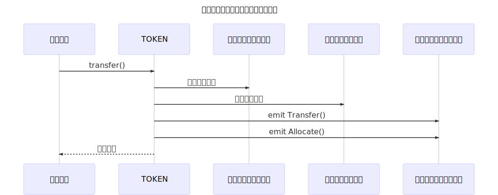
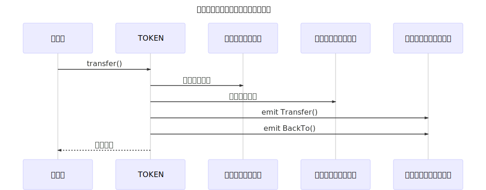
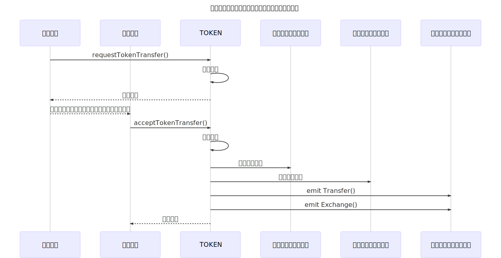
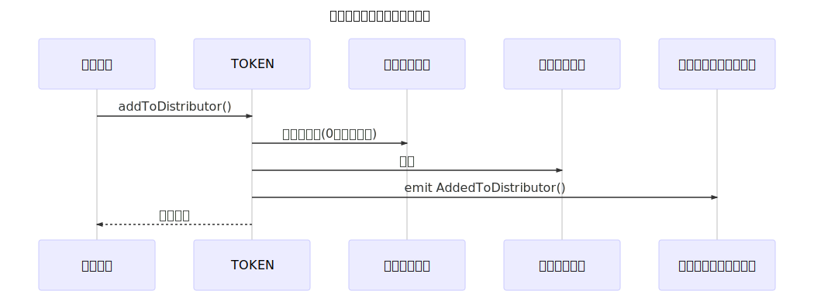
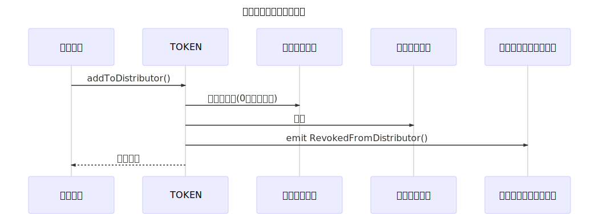

# Implementation of "Internal Distribution Token"

*Read this in other languages: [English](README.md), [日本語](README.ja.md).*

*It is under development.*

## 概要

流通やその価値が管理された内部流通トークンを実装する。

（例えば、お買い物をしたときにつくショッピングポイントや、スタンプカードのように・・・）

トークンは暗号通貨のスマートコントラクトおよび関連技術の仕組みを使って実現する。

## 要点

管理された流通をスマートコントラクト内で実現するための基本機能を提供します。
また、通常のトークンの場合に発生する、送金時の手数料(GAS)の問題も解決します。

## このトークンによって実現できること

**実現した場合のメリット**

-   仮想通貨として位置付けされない（通常、上場した時点でお金の価値が発生するとのことから）
-   トークンの配布や交換などについて、暗号通貨のスマートコントラクト技術を利用することができる
-   従来のトークンとは異なり、Ether や EOS などパブリックチェーンに記録されるため、不正防止や透明性が担保される
-   トークンの価値（価格）を固定化できる
-   ユーザーには手数料が発生しないため、Ether を持つ必要がなく、スマートコントラクトの利用普及を望めるかもしれない

## 仕様

ERC20 トークンのような使い勝手でありながら、ユーザーが勝手にコインを配布したりできないようにしたい。

通常のトークンは、利用者同士が互いに自由にトークンを送ることができるため、お買い物のポイントのような次の制約が必要である。

**トークンの保有者を次の３つの役割に分ける**

-   オーナー（このスマートコントラクトのオーナー）
-   配布者（オーナーから割り当てられたトークンを実際にユーザーへ配布する係）
-   ユーザー（お買い物をして、トークンを集める）

トークンのおおまかな流れはこのようになる。



-   配布者はオーナーによって決定される
-   配布者にはオーナーからトークンを割り当てられる
-   配布者はユーザーへ任意のトークンを配布する
-   ユーザーは保有するトークンの照会 `balanceOf()` やトークンの移動の記録 `Transfer()` を ERC20 トークンと同じ仕組みで確認できる
-   ユーザーはオーナーにトークンの交換を申請できる・・・（A）
-   オーナーはユーザーが申請した数量のトークンを受け取ることができる・・・（B）

（A）から（B）への情報伝達はオフチェーンにより行うが、実装例は後ほど記載する。

**トークンのインターフェース**

```solidity
pragma solidity ^0.5.0;

interface InternalDistributionTokenInterface {
    // Required methods

    // @title Is the ETH address of the argument the distributor of the token?
    // @param _account
    // @return bool (true:owner false:not owner)
    function isDistributor(address _account) external view returns (bool);

    // @title A function that adds the ETH address of the argument to the distributor list of the token
    // @param _account ETH address you want to add
    // @return bool
    function addToDistributor(address _account) external returns (bool success);

    // @title A function that excludes the ETH address of the argument from the distributor list of the token
    // @param _account ETH address you want to delete
    // @return bool
    function deleteFromDistributor(address _account) external returns (bool success);

    // @title A function that accepts a user's transfer request (executed by the contract owner)
    // @param bytes memory _signature
    // @param address _requested_user
    // @param uint256 _value
    // @param string _nonce
    // @return bool
    function acceptTokenTransfer(bytes calldata _signature, address _requested_user, uint256 _value, string calldata _nonce)
        external
        returns (bool success);

    // @title A function that generates a hash value of a request to which a user sends a token (executed by the user of the token)
    // @params _requested_user ETH address that requested token transfer
    // @params _value Number of tokens
    // @params _nonce One-time string
    // @return bytes32 Hash value
    // @dev The user signs the hash value obtained from this function and hands it over to the owner outside the system
    function requestTokenTransfer(address _requested_user, uint256 _value, string calldata _nonce) external view returns (bytes32);

    // @title Returns whether it is a used signature
    // @params _signature Signature string
    // @return bool Used or not
    function isUsedSignature(bytes calldata _signature) external view returns (bool);

    // Events

    // token assignment from owner to distributor
    event Allocate(address indexed from, address indexed to, uint256 value);

    // tokens from distributor to users
    event Distribute(address indexed from, address indexed to, uint256 value);

    // tokens from distributor to owner
    event BackTo(address indexed from, address indexed to, uint256 value);

    // owner accepted the token from the user
    event Exchange(address indexed from, address indexed to, uint256 value, bytes signature, string nonce);

    event AddedToDistributor(address indexed account);
    event DeletedFromDistributor(address indexed account);
}

```

**インターフェースでは定義できない仕様を以下に記す**

配布者の追加や抹消はオーナーだけが実行できるように実装する。
配布者の抹消は、配布者がトークンを保有していない場合に実行ができるように実装する。

```solidity
    // @title A function that adds the ETH address of the argument to the distributor list of the token
    // @param _account ETH address you want to add
    // @return bool
    function addToDistributor(address _account) external onlyOwner returns (bool success) {
        // `_account` is a correct address
        require(_account != address(0), "Correct EOA address is required");

        // `_account` is necessary to have no token
        require(_balances[_account] == 0, "This EOA address has a token");

        // `_account` is not an owner or a distributor
        require(this.isOwner(_account) == false && this.isDistributor(_account) == false, "This EOA address can not be a distributor");

        // `_account` is not a contract address
        require(_account.isContract() == false, "Contract address can not be specified");

        // Add to distributor
        Distributors.add(_account);

        emit AddedToDistributor(_account);

        return true;
    }
```

```solidity
    // @title A function that excludes the ETH address of the argument from the distributor list of the token
    // @param _account ETH address you want to delete
    // @return bool
    function deleteFromDistributor(address _account) external onlyOwner returns (bool success) {
        // `_account` is a correct address
        require(_account != address(0), "Correct EOA address is required");

        // `_account` is necessary to have no token
        require(_balances[_account] == 0, "This EOA address has a token");

        // Delete from distributor
        Distributors.remove(_account);

        emit DeletedFromDistributor(_account);

        return true;
    }
```

ユーザーはオーナーに送金したいトークンの数量を指定する。

`requestTokenTransfer()` を実行することにより、次の情報をハッシュ化する。

-   送金をリクエストしているユーザーの EOA アドレス
-   送金したい数量
-   送金のリクエストを識別する文字列 `_nonce`

交換したいトークンの数量を次の実装により得るが、その際の `_nonce` は重複しないものを与える必要がある。

`requestTokenTransfer()` の実行時にはトランザクションが発生しないため、連番などのカウントをトークンの内部で行うことができない。

そのため、関数を実行する際に引数として与えて上げる必要があるが、一例としては [Nano ID](https://github.com/ai/nanoid) のような推測が難しい文字列を使用するとよいと思われる。

また、得られた得られた署名、はブロックチェーン以外の方法でオーナーへ引き渡す。

```solidity
    // @title A function that generates a hash value of a request to which a user sends a token (executed by the user of the token)
    // @params _requested_user ETH address that requested token transfer
    // @params _value Number of tokens
    // @params _nonce One-time string
    // @return bytes32 Hash value
    // @dev The user signs the hash value obtained from this function and hands it over to the owner outside the system
    function requestTokenTransfer(address _requested_user, uint256 _value, string calldata _nonce) external view returns (bytes32) {
        return keccak256(abi.encodePacked(address(this), bytes4(0x8210d627), _requested_user, _value, _nonce));
    }
```

オーナーはユーザーより次の値を受け取り、`acceptTokenTransfer()` 関数を実行する。

-   署名文字列
-   送金したいユーザーの EOA アドレス
-   送りたいトークンの数
-   署名時の `_nonce` の値

```solidity
    // @title A function that accepts a user's transfer request (executed by the contract owner)
    // @param bytes _signature
    // @param address _requested_user
    // @param uint256 _value
    // @param string _nonce
    // @return bool
    function acceptTokenTransfer(bytes calldata _signature, address _requested_user, uint256 _value, string calldata _nonce)
        external
        onlyOwner
        returns (bool success)
    {
        // argument `_signature` is not yet used
        require(usedSignatures[_signature] == false);

        // Recalculate hash value
        bytes32 hashedTx = this.requestTokenTransfer(_requested_user, _value, _nonce);

        // Identify the requester's ETH Address
        address _user = hashedTx.recover(_signature);

        require(_user != address(0), "Unable to get EOA address from signature");

        // the argument `_requested_user` and
        // the value obtained by calculation from the signature are the same ETH address
        //
        // If they are different, it is judged that the user's request has not been transmitted correctly
        require(_user == _requested_user, "EOA address mismatch");

        // user has the amount of that token
        require(this.balanceOf(_user) >= _value, "Insufficient funds");

        _balances[_user] = _balances[_user].sub(_value);
        _balances[msg.sender] = _balances[msg.sender].add(_value);

        // Record as used signature
        usedSignatures[_signature] = true;

        // Execute events
        emit Transfer(_user, msg.sender, _value);
        emit Exchange(_user, msg.sender, _value, _signature, _nonce);

        return true;
    }
```

#### オーナーが配布者にトークンを割当



#### 配布者がユーザーにトークン配布


#### 配布者がオーナーにトークンを返却



#### ユーザーがトークンのトークン交換の申請を行う



#### オーナーが配布者を追加登録



#### オーナーが配布者を抹消



### 実装上の注意事項

〜現在トークン交換の申請として実装されている署名方式について〜

`web3.eth.sign()` は廃止の予定があるため、EIP-712による署名検証を採用する予定ですが、
本体には組み込まず、ÐAppsを別のリポジトリで実装の実験を行っています。

- Signing message with eth.sign never finishes · Issue #1530 · MetaMask/metamask-extension
https://github.com/MetaMask/metamask-extension/issues/1530

- Signature verification implementation for EIP712 https://github.com/godappslab/signature-verification

しばらくの間は`web3.eth.sign()`が動作しますが、EIP712 署名へ切り替えていく予定です。



## Test Cases

[Truffle Suite ](https://truffleframework.com/) を利用したテストスクリプトで動作確認を行う。

ただし、署名の処理について、正しく機能しないため、その部分についてはブラウザを使ったテストを行う。

## 実装

トークンの実装は GitHub にて公開する。

https://github.com/godappslab/internal-distribution-token

ウェブサイトからも、このトークンを操作することができる。（現在は Ropsten Test Network のみ利用可能）

https://lab.godapps.io/points/

## 参考文献

**Standards**

1.  ERC-20 Token Standard. https://github.com/ethereum/EIPs/blob/master/EIPS/eip-20.md

**Issues**

1.  ERC865: Pay transfers in tokens instead of gas, in one transaction #865 https://github.com/ethereum/EIPs/issues/865
